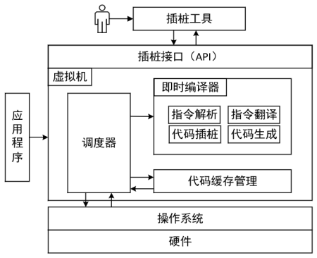
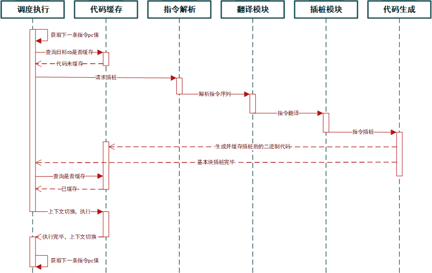
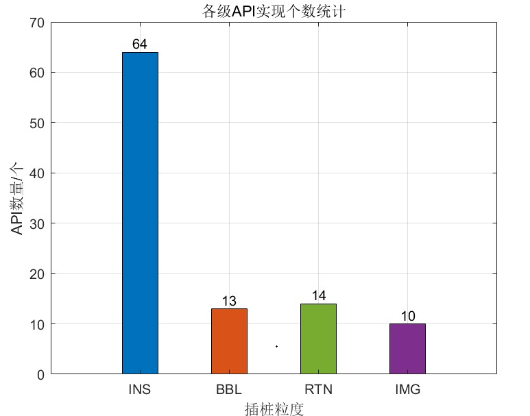
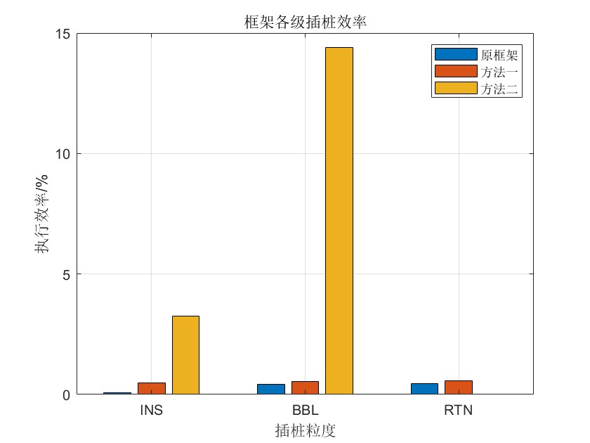

# 啥啥都队

## 队伍介绍

我们队伍名称为啥啥都队，来自中国科学技术大学，基本情况如下：

| 赛题     | proj333——基于Qemu的龙架构平台高性能插桩工具 |
| -------- | ------------------------------------------- |
| 小组成员 | 高林萍、穆奕博、陈曦                        |
| 指导老师 | 徐伟、卢建良                                |

## 文档

* **[复赛项目文档](./doc-readme/%E5%9F%BA%E4%BA%8EQemu%E7%9A%84%E9%BE%99%E6%9E%B6%E6%9E%84%E9%AB%98%E6%80%A7%E8%83%BD%E6%8F%92%E6%A1%A9%E5%B7%A5%E5%85%B7.pdf)**
* **[代码结构](target/loongarch/instrument/doc/code_structure.md)**
* **[插桩工具教程](target/loongarch/instrument/doc/eazy_pintool.md)**
* **[框架编译和使用](target/loongarch/instrument/doc/how_to_build.md)**

## 项目简介

### 背景介绍

随着软件行业的飞速发展，软件的规模和复杂性持续增长，这使得监控程序在运行过程中的行为变的越来越有挑战性。动态二进制插桩技术可以在不影响程序运行结果的前提下，在程序运行时插入分析代码，从而实现对程序的监控和分析。其在代码调试，安全性能检测，性能分析和代码分析等诸多场景有广泛应用。

二进制插桩技术发展至今，已经拥有了诸多各具特色的插桩框架，然而这些框架只支持主流的指令集架构，对于国产自主研发的指令集架构缺少高效的插桩框架。

为了解决这一问题，我们团队基于Qemu模拟器，设计并实现了一个支持龙芯指令集的高效二进制插桩框架原型。该框架原型能够在指令、基本块、函数和镜像等多个粒度上进行插桩，实现了对程序执行过程的全面监控。团队设计实现了与Pin高度兼容的大部分通用API。

### 整体框架

本系统的整体架构如上图所示，其主要由虚拟机、代码缓存与插桩接口构成，虚拟机中包含调度器和即时编译器。用户编写的插桩工具通过插桩接口，向插桩框架注册插桩函数。插桩框架先将应用程序加载到内存中完成初始化，随后虚拟机中的调度器负责协调各个部件来运行应用程序。 虚拟机采用即时编译（JIT）的方式运行来应用程序，在截获应用程序的执行流后，对应用程序的将要执行的二进制代码进行解析，得到指令序列并进行插桩，最后生成插桩后的二进制代码，并交给调度器进行执行。插桩后的二进制代码会被保存到代码缓存中，以避免重复的插桩工作。插桩框架会拦截应用程序的系统调用，并在插桩框架的控制下模拟执行。

框架运行时序图如上图所示。

### 初赛阶段成果概述

**为框架设计并实现了指令级（INS）、基本块级（BBL）、轨迹级（TRACE）、函数级（RTN）以及镜像级（IMG）五个基本插桩粒度，同时添加了各粒度通用API。**

#### INS级

INS级API的是以一条汇编指令为插桩对象设计实现的API。在框架中，一条原始的指令在经过代码解析模块，翻译模块和插桩模块的处理后，会生成与原始指令功能相同的一条或多条指令，每条指令由数据结构Ins描述，这些Ins共同组成了一个INS块。INS块是整个框架插桩操作的最小单位，也是可插桩的最细粒度。

#### BBL级

BBL级API的是以一个基本块为插桩对象设计实现的API。BBL是一个单入口单出口的指令序列，如果一个基本块的出口指向另一个基本块的中间，那么将会产生一个新的基本块。以下三种情况可以作为基本块的入口： 1. 进入程序的第一条指令。
2. 一个基本块结束后，紧跟着基本块的下一条指令。
3. 跳转指令的目标地址处的指令。
 条件跳转指令，无条件跳转指令，系统调用等控制执行流的指令可作为基本块的出口。基本块是程序能够连续执行的最小指令序列。

#### TRACE级

TRACE通常是一个单入口多出口的指令序列，入口是上一个TRACE解析完此时PC中的地址，出口有两种情况：1.无条件跳转指令。2.TRACE中第三个基本块最后的条件跳转指令。一个TRACE中的基本块数不大于3。如果有一条跳转指令的目标地址在TRACE中间，那么将会在原有的BBL基础上产生新的BBL，同时也产生新的TRACE。

#### RTN级

RTN级API是以函数为插桩对象设计实现的API，应用程序运行时需要用到大量的符号，在动态链接时产生的相关符号信息即是所需收集的函数，可以通过符号解析进行RTN的获取。函数级API可以获取RTN的各种信息，允许在特定RTN的入口和出口处进行插桩分析，每个RTN有一个入口和多个出口。

#### IMG级

IMG级API是以二进制可执行文件为插桩对象设计实现的API，每加载一个可执行文件就创建一个IMG，每个IMG中包含多个RTN，镜像级API可以获取IMG的各种信息，允许在程序运行过程中对程序进行插桩和分析。

## API实现情况

各级API实现统计图如上所示，其中INS级API实现个数为64，BBL级API实现个数为13，RTN级API实现个数为14，IMG级API实现个数为10。具体API如下。

#### INS级

 ✅ VOID INS_AddInstrumentFunction(INS_INSTRUMENT_CALLBACK fun, VOID* val);
 ✅ VOID INS_InsertCall(INS INS, IPOINT action, AFUNPTR funptr, ...)
 ✅ VOID INS_InsertPredicatedCall (INS ins, IPOINT ipoint, AFUNPTR funptr,...)
 ✅ VOID INS_InsertIfCall (INS ins, IPOINT action, AFUNPTR funptr,...)
 ✅ VOID INS_InsertThenCall (INS ins, IPOINT action, AFUNPTR funptr,...)
 ✅ VOID INS_InsertIfPredicatedCall (INS ins, IPOINT action, AFUNPTR funptr,...)
 ✅ VOID INS_InsertThenPredicatedCall (INS ins, IPOINT action, AFUNPTR funptr,...)

 ✅ INS INS_Next(INS x)
 ✅ INS INS_Prev(INS x)
 ✅ BOOL INS_Valid(INS x)
 ✅ ADDRINT INS_Address (INS ins)
 ✅ USIZE INS_Size (INS ins)
 ✅ enum PREDICATE INS_GetPredicate (INS ins)
 ✅ BOOL INS_IsMemoryRead (INS ins)
 ✅ BOOL INS_IsMemoryWrite (INS ins)
 ✅ BOOL INS_HasFallThrough (INS ins)
 ✅ const char *INS_Mnemonic (INS ins)
 ✅ BOOL INS_IsBranch (INS ins)
 ✅ BOOL INS_IsDirectBranch (INS ins)
 ✅ BOOL INS_IsDirectCall (INS ins)
 ✅ BOOL INS_IsDirectControlFlow (INS ins)
 ✅ BOOL INS_IsCall (INS ins)
 ✅ BOOL INS_IsControlFlow (INS ins)
 ✅ BOOL INS_IsInterrupt (INS ins)
 ✅ BOOL INS_IsRet (INS ins)
 ✅ BOOL INS_IsPrefetch (INS ins)
 ✅ BOOL INS_IsMov (const INS ins)
 ✅ BOOL INS_IsAtomicUpdate (const INS ins)
 ✅ BOOL INS_IsIndirectControlFlow (INS ins)
 ✅ OPCODE INS_Opcode (INS ins)
 ✅ const char *INS_Disassemble (INS ins)
 ✅ UINT32 INS_OperandCount (INS ins)
 ✅ UINT32 INS_MemoryOperandCount (INS ins)
 ✅ USIZE INS_MemoryOperandSize (INS ins, UINT32 memoryOp)
 ✅ BOOL INS_MemoryOperandIsRead (INS ins, UINT32 memopIdx)
 ✅ BOOL INS_MemoryOperandIsWritten (INS ins, UINT32 memopIdx)
 ✅ BOOL INS_OperandIsReg (INS ins, UINT32 n)
 ✅ REG INS_OperandReg (INS ins, UINT32 n)
 ✅ BOOL INS_OperandIsImmediate (INS ins, UINT32 n)
 ✅ UINT64 INS_OperandImmediate (INS ins, UINT32 n)
 ✅ BOOL INS_OperandRead (INS ins, UINT32 n)
 ✅ BOOL INS_OperandWritten (INS ins, UINT32 n)
 ✅ BOOL INS_OperandReadOnly (INS ins, UINT32 n)
 ✅ BOOL INS_OperandWrittenOnly (INS ins, UINT32 n)
 ✅ BOOL INS_OperandReadAndWritten (INS ins, UINT32 n)
 ✅ BOOL INS_IsSyscall (INS ins)
 ✅ INS INS_Invalid (void)
 ✅ ADDRINT INS_DirectControlFlowTargetAddress (INS ins)
 ✅ ADDRINT INS_NextAddress (INS ins)
 ✅ UINT32 INS_EffectiveAddressWidth(INS ins)
 ✅ BOOL INS_IsValidForIpointAfter(INS ins)
 ✅ BOOL INS_IsValidForIpointTakenBranch (INS ins)
 ✅ BOOL INS_IsProcedureCall (INS ins)
 ✅ BOOL INS_IsSub(const INS ins)
 ✅ BOOL INS_IsOriginal(INS ins)
 ✅ BOOL INS_OperandIsMemory (INS ins, UINT32 n)
 ✅ UINT32 INS_MemoryOperandIndexToOperandIndex (INS ins, UINT32 memopIdx)
 ✅ BOOL INS_OperandIsImplicit (INS ins, UINT32 n)
 ✅ BOOL INS_RegIsImplicit (INS ins, REG reg)
 ✅ BOOL INS_IsAddedForFunctionReplacement (INS ins)
 ✅ BOOL INS_ChangeReg (const INS ins, const REG old_reg, const REG new_reg, const BOOL as_read)
 ✅ VOID INS_InsertIndirectJump (INS ins, IPOINT ipoint, REG reg)
 ✅ VOID INS_InsertDirectJump (INS ins, IPOINT ipoint, ADDRINT tgt)
 ✅ VOID INS_Delete (INS ins)

#### BBL级

 ✅ VOID BBL_InsertCall(BBL bbl, IPOINT action, AFUNPTR funptr, ...)
 ✅ VOID BBL_InsertIfCall (BBL bbl, IPOINT action, AFUNPTR funptr,...)
 ✅ VOID BBL_InsertThenCall (BBL bbl, IPOINT action, AFUNPTR funptr,...)

 ✅ UINT32 BBL_NumIns(BBL bbl)
 ✅ INS BBL_InsHead(BBL x)
 ✅ INS BBL_InsTail(BBL x)
 ✅ BBL BBL_Next(BBL x)
 ✅ BBL BBL_Prev(BBL x)
 ✅ BOOL BBL_Valid(BBL x)
 ✅ BOOL BBL_Original(BBL bbl)
 ✅ ADDRINT BBL_Address(BBL x)
 ✅ USIZE BBL_Size(BBL x)
 ✅ BOOL BBL_HasFallThrough(BBL x)

#### TRACE级

 ✅ VOID TRACE_AddInstrumentFunction(TRACE_INSTRUMENT_CALLBACK fun, VOID *val)
 ✅ VOID TRACE_InsertCall(TRACE trace, IPOINT action, AFUNPTR funptr, ...)
 ✅ VOID TRACE_InsertIfCall (TRACE trace, IPOINT action, AFUNPTR funptr,...)
 ✅ VOID TRACE_InsertThenCall (TRACE trace, IPOINT action, AFUNPTR funptr,...)

 ✅ BBL TRACE_BblHead(TRACE trace)
 ✅ BBL TRACE_BblTail(TRACE trace)
 ✅ UINT32 TRACE_NumBbl(TRACE trace)
 ✅ UINT32 TRACE_NumIns(TRACE trace)
 ✅ ADDRINT TRACE_Address(TRACE trace)
 ✅ USIZE TRACE_Size(TRACE trace)
 ✅ RTN TRACE_Rtn(TRACE trace)
 ✅ BOOL TRACE_HasFallThrough (TRACE trace)

#### RTN级
 ✅ VOID RTN_InsertCall(RTN rtn, IPOINT action, AFUNPTR funptr, ...)

 ✅ IMG RTN_Img(RTN rtn)
 ✅ RTN RTN_Next(RTN rtn)
 ✅ RTN RTN_Prev(RTN rtn)
 ✅ RTN RTN_Invaild(void
 ✅ BOOL RTN_Valid(RTN rtn)
 ✅ const char * RTN_Name(RTN rtn)
 ✅ UINT32 RTN_Id(RTN rtn)
 ✅ USIZE RTN_Size(RTN rtn)
 ✅ const CHAR *RTN_FindNameByAddress(ADDRINT address)
 ✅ RTN RTN_FindByAddress(ADDRINT address)
 ✅ RTN RTN_FindByName(IMG img, const CHAR *name)
 ✅ UINT32 RTN_NumIns(RTN rtn)
 ✅ ADDRINT RTN_Address(RTN rtn)

#### IMG级

 ✅ VOID IMG_AddInstrumentFunction(IMAGECALLBACK fun, VOID *val)

 ✅ IMG IMG_Next(IMG img)
 ✅ IMG IMG_Prev(IMG img)
 ✅ IMG IMG_Invalid(void)
 ✅ BOOL IMG_Valid(IMG img)
 ✅ RTN IMG_RtnHead(IMG img)
 ✅ RTN IMG_RtnTail(IMG img)
 ✅ const char * IMG_Name(IMG img)
 ✅ UINT32 IMG_Id(IMG img)
 ✅ IMG IMG_FindImgById(UINT32)

### 决赛阶段成果概述

**初赛阶段，我们设计实现了四种基本粒度的插桩API，同时为了保证框架和TRACE级API的正确运行，取消了基本块链接模块。决赛阶段，我们通过优化跳转指令翻译、恢复基本块链接和内联插桩提高了框架的插桩执行效率，同时设计实现了更多的插桩工具实例。**

#### 优化跳转指令翻译

增加条件跳转不成立时的上下文切换标志，初始化为0。每开始翻译一个新的TRACE，只有当此时的BBL是TRACE中的最后一个TRACE，且该BBL以条件跳转指令为结尾时，该标志才为1，最后一个BBL才会在跳转条件不成立时跳转到上下文切换寻找下一个TRACE基本块，否则则顺序执行当前TRACE中的下一个BBL，减少上下文切换次数。

#### 恢复基本块链接
* 方法一：链接部分BBL。翻译得到基本块时，B、BL和最后一个BBL中的条件跳转指令都可以是TRACE的最后一条指令，对这类指令保留跳转出口，对于TRACE中非最后一个BBL中的条件跳转指令，翻译时，不添加任何nop指令，当满足跳转条件时，直接回到调度模块，查找下一个执行的基本块，不进行基本块链接。
* 方法二：链接全部BBL。将TRACE结构修改为至多包含两个BBL，新增一个基本块跳转出口，保存跳转出口在TB中的偏移值，重新设置TB执行结束的返回值，根据上一个TB执行完返回的ret值，提取上一个执行的TB的地址和跳转出口，再根据当前TB的地址，进行基本块链接。

#### 内联插桩
为诸如“对内存中的某个值做加法”这样简单而常用的函数编写了内联插桩接口，用户在使用时可以直接调用这些接口，pintool在运行时将直接执行这些简单的函数，无需进行调用，节省了函数调用开销。

#### 插桩工具实例设计

| Pintool名称     |     级别     |                 功能                  |
| ---------------| -------------|------------------------------------- |
| bbl_ctrlFlow | BBL    |         记录控制流的变化情况                    |
| bbl_info | BBL | 记录基本块地址及跳转指令 |
| bbl_time_record | BBL    |      记录基本块的运行时间和运行次数              |
| call_trace | RTN    |         统计所有调用的函数及其部分参数                     |
| dynamic_ins_mix | INS    |         记录不同类型指令的执行次数                     |
| emuload | INS    |         记录数据从内存加载到寄存器的过程                     |
| jump_mix | INS | 统计控制流变化的次数 |
| ldstmix | INS | 统计load/stroe指令 |
| regmix | INS    |         记录程序读写通用寄存器的次数                     |
| top_routine | RTN | 实时记录函数调用次数 |
| trace_info | TRACE | 记录程序过程信息 |

### 性能测试
无基本块链接的原框架、使用方法一链接后的框架和使用方法二链接后的框架各级插桩的执行效率如下图所示。方法一相较原框架执行效率有较小幅度提升，方法二相较原框架和方法一都有极其显著的提升。

## 代码仓库

本项目是基于QEMU设计实现的插桩框架，项目主仓库以及项目主要插桩文件的地址如下，供参考：

| 仓库/主文件         | 仓库/主文件地址                                                     |
| ------------- | ------------------------------------------------------------ |
| 本项目主仓库  | https://gitlab.eduxiji.net/T202410358992583/project2210132-232208 |
| 本项目主文件  | https://gitlab.eduxiji.net/T202410358992583/project2210132-232208/-/tree/main/target/loongarch |

## 参考资料

* [qemu-instrument](https://github.com/foxsen/qemu-instrument/tree/instru)
* [Loongarch Docs](https://github.com/loongson/LoongArch-Documentation)龙芯相关手册

